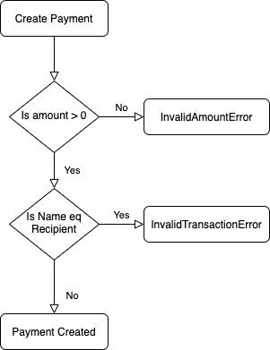
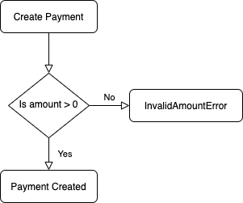

# Simple Scala payment micro-service

## Tech-Stack:
 - Http4s - Http server
 - Doobie - Database IO
 - Circe  - Json encoding/decoding
 - Cats - Functional Lib
 - Cats-Effect - Functional Effects
 - PureConfig - Config Parsing

 ---

## Service Endpoints

| Url             | Method   | Body   |
| :---            | :---:    | :---   |
| /status         | GET      | None   |
| /payment/create | POST     | `{"name" : "John", "amount" : 100, "recipient" : "Doe"}` |
| /payment/update | PUT      | `{"id" : "1b9d6bcd-bbfd-4b2d-9b5d-ab8dfbbd4bed", "amount" : 200 }` |

---
## Endpoint Responses
### /status
```json
{"status" : "ok"}
```

### /payment/create
Success:
```json
{
    "id": "b48b14c9-678e-4c58-8a9d-bd8b82e3b270",
    "name": "John",
    "amount": 100.000,
    "recipient": "Doe"
}
```

Error:
```json
{
    "error_message": "Provided amount [0.0] has to be greater than 0",
    "error": "invalid_amount"
}
```
```json
{
    "error_message": "Payer name cannot be the same as recepient name",
    "error": "invalid_transaction"
}
```

### /payment/update
Success:
```json
{
    "id": "b48b14c9-678e-4c58-8a9d-bd8b82e3b270",
    "name": "John",
    "amount": 999.000,
    "recipient": "Doe"
}
```

Error:
```json
{
    "error_message": "Provided amount [0.0] has to be greater than 0",
    "error": "invalid_amount"
}
```
---

## Payment Creation


## Payment Update
